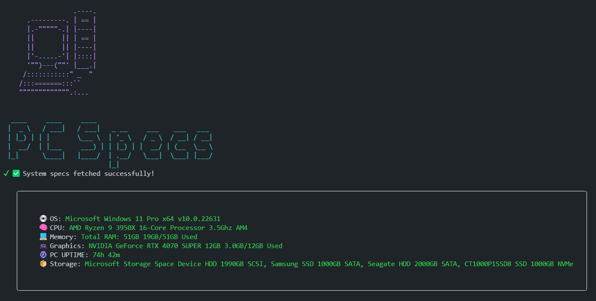

# NODE PC Specs CMD App 



This program was made purely for fun and to pratice NODE JS. Feel free to try ot on your own machine. 

## How to Use? 

1. First clone the repository to your own machine. 
2. **You have to install dependencies:** 

```
npm install 
```

Then **start the program** from the command line with: 

```
npm start
```

Used libraries and packages: 

- [boxen](https://www.npmjs.com/package/boxen) - to create box around the actul specs data
- [chalk](https://www.npmjs.com/package/chalk) - to color text in the commandline
- [figlet](https://www.npmjs.com/package/figlet) - for the stylized ASCII header.
- [ora](https://www.npmjs.com/package/ora) - to implement the spinner loader. 
- [systeminformation](https://www.npmjs.com/package/systeminformation) - For getting the system informations. 

**Contributions are welcomed! 🥳🙌🏻**
